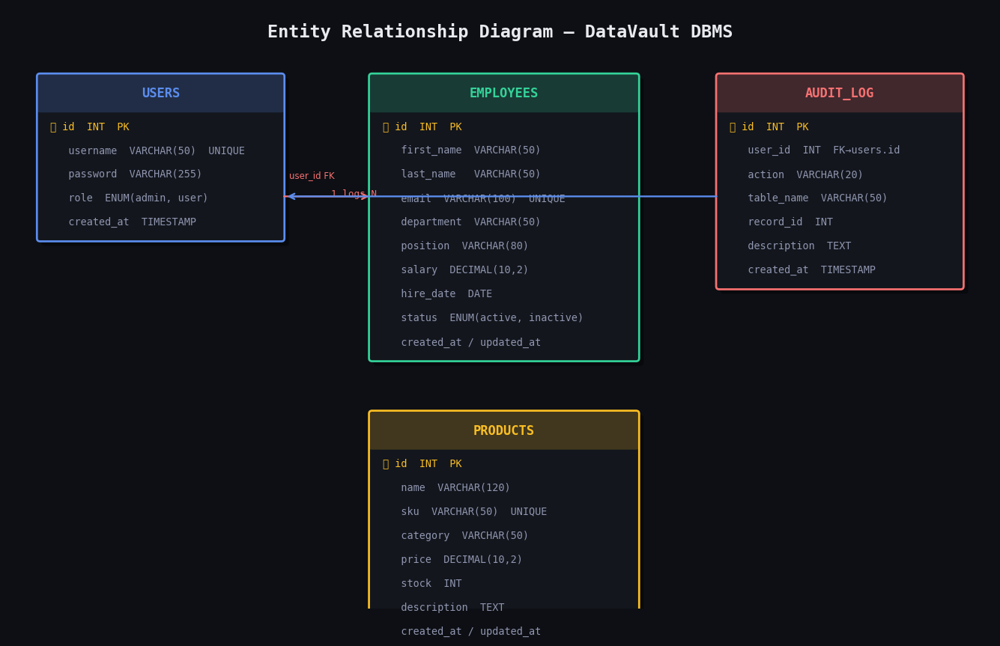
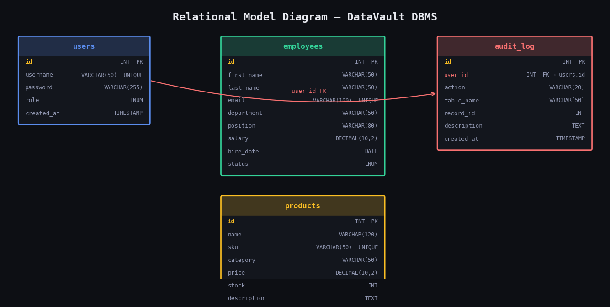

# DataVault DBMS

> **Information Management 1 — CCCS105**
> Camarines Sur Polytechnic Colleges

---

## Table of Contents

1. [Introduction](#1-introduction)
2. [Project Objectives](#2-project-objectives)
3. [Business Rules](#3-business-rules)
4. [Database Models](#4-database-models)
5. [Project Overview](#5-project-overview)
6. [Setup Instructions](#6-setup-instructions)
7. [Team Members & Roles](#7-team-members--roles)
8. [Dependencies](#8-dependencies)
9. [Running Instructions](#9-running-instructions)

---

## 1. Introduction

### Background

Data is the backbone of every modern organization. Without a structured way to store, retrieve, and manage data, even simple business processes become error-prone and unscalable. Database Management Systems (DBMS) address this need by providing a reliable, organized layer between raw data and the people or systems that use it.

This project, **DataVault**, was developed as part of Information Management 1 (CCCS105) to demonstrate these concepts in a practical, working application. It simulates a real-world internal management tool — the kind that a small company or organization would use to manage its employee records and product inventory.

### Problem Statement

Many small organizations rely on spreadsheets or manual records to track employee and product data. This approach is fragile: data can be accidentally overwritten, there is no access control, no audit trail, and no way to validate what is entered. The challenge this project addresses is:

- **How do we store and manage structured data reliably?**
- **How do we give users a safe, validated interface to perform operations on that data?**
- **How do we ensure that only authorized users can access and modify sensitive records?**

### Scope

**Included:**
- User authentication (login, logout, registration)
- Full CRUD operations on two data tables: Employees and Products
- Search and filter functionality
- Data export to CSV and Excel
- Audit logging of all data-modifying operations
- A dashboard with live statistics and recent activity
- Responsive web-based interface

**Not included:**
- Role-based access control beyond admin/user distinction
- Multi-database or multi-server connectivity
- Real-time collaboration or multi-user conflict resolution
- Mobile native application

### Target Users

| User Type | Description |
|-----------|-------------|
| **Administrators** | Can manage all records, view audit logs, and access all features |
| **Regular Users** | Can view and manage records but cannot access admin-only settings |
| **Students / Evaluators** | Use the system to understand DBMS concepts in a working context |

---

## 2. Project Objectives

### Primary Objective

To design and develop a functional web-based database application that demonstrates complete CRUD (Create, Read, Update, Delete) operations using Python, Flask, and a MySQL database via XAMPP.

### Secondary Objectives

- **Database Connectivity** — Establish a reliable, reusable connection between the Python application and a MySQL database using `mysql-connector-python`.
- **User Interface** — Provide a clean, intuitive web interface that non-technical users can navigate without confusion.
- **Data Management** — Implement structured forms, server-side validation, and error handling to ensure data integrity at all times.
- **Search Functionality** — Allow users to search and filter records by keyword and category without writing SQL manually.
- **Data Export** — Enable users to download their current filtered view as a CSV or Excel file for use in external tools.
- **Security** — Protect the application with session-based authentication and bcrypt-hashed password storage.
- **Auditability** — Log every data-modifying action (INSERT, UPDATE, DELETE) with the responsible user and timestamp.

---

## 3. Business Rules

### Detailed Business Logic

#### User Authentication
- Every user must have a unique username.
- Passwords must be at least 6 characters long.
- Passwords are stored as **bcrypt hashes** — plain-text passwords are never saved to the database.
- A user must be logged in to access any page other than Login and Register.
- Sessions are managed by Flask's server-side session mechanism.

#### Database Connection Settings
- The application connects to a MySQL server running on `localhost` at port `3306`.
- The database name is `CCCS105`.
- The default username is `root` with an empty password (standard XAMPP configuration).
- Connection settings can be overridden via environment variables without changing source code.

#### CRUD Operation Constraints

| Table | Unique Constraint | Required Fields |
|-------|------------------|-----------------|
| employees | `email` | first_name, last_name, email, department, position, salary, hire_date |
| products | `sku` | name, sku, category, price, stock |

- A record cannot be saved if any required field is empty.
- Duplicate emails (employees) or SKUs (products) are rejected with a clear error message.
- Salary and price must be non-negative decimal numbers.
- Stock must be a non-negative integer.
- Hire date must be a valid calendar date.

#### Data Validation Rules
- All string fields are trimmed of leading/trailing whitespace before saving.
- Email fields are checked for the presence of `@` and a domain.
- SKUs are automatically converted to uppercase on save.
- Numeric fields that cannot be parsed produce a validation error.
- Validation is performed **server-side** — client-side hints are supplementary only.

#### Access Control
- All routes except `/login` and `/register` are protected by a `@login_required` decorator.
- Unauthenticated requests to protected routes are redirected to the login page.
- Delete operations use HTTP `POST` (not `GET`) to prevent accidental deletion via URL.

### Constraints

- The application requires an active MySQL server (via XAMPP) to function.
- The database `CCCS105` must exist and be populated with the schema before the app starts.
- The application is designed for local/intranet use; it is not hardened for public internet deployment without additional security measures.
- All SQL queries use **parameterized statements** (`%s` placeholders) to prevent SQL injection.

### Conditions

- A user session expires when the browser is closed or the user clicks Logout.
- Every INSERT, UPDATE, and DELETE action is recorded in the `audit_log` table regardless of which user performs it.
- If the database connection fails at startup, Flask will raise a connection error on the first request — the XAMPP MySQL service must be running before the app is launched.
- Pagination shows 10 records per page by default; this can be changed in `config.py`.

---

## 4. Database Models

### Entity Relationship Diagram (ERD)



The system contains four entities:

| Entity | Description |
|--------|-------------|
| **users** | Stores login credentials and roles for all system users |
| **employees** | Stores employee records — the primary CRUD table |
| **products** | Stores product/inventory records — the secondary CRUD table |
| **audit_log** | Logs every INSERT, UPDATE, and DELETE, linked to the user who performed it |

**Relationships:**
- `audit_log.user_id` → `users.id` (Many-to-One): Many audit log entries can belong to one user.
- `employees` and `products` are independent entities with no foreign key between them.

### Relational Model



#### users
| Column | Type | Constraints |
|--------|------|-------------|
| id | INT | PK, AUTO_INCREMENT |
| username | VARCHAR(50) | UNIQUE, NOT NULL |
| password | VARCHAR(255) | NOT NULL (bcrypt hash) |
| role | ENUM('admin','user') | NOT NULL, DEFAULT 'user' |
| created_at | TIMESTAMP | DEFAULT CURRENT_TIMESTAMP |

#### employees
| Column | Type | Constraints |
|--------|------|-------------|
| id | INT | PK, AUTO_INCREMENT |
| first_name | VARCHAR(50) | NOT NULL |
| last_name | VARCHAR(50) | NOT NULL |
| email | VARCHAR(100) | UNIQUE, NOT NULL |
| department | VARCHAR(50) | NOT NULL |
| position | VARCHAR(80) | NOT NULL |
| salary | DECIMAL(10,2) | NOT NULL |
| hire_date | DATE | NOT NULL |
| status | ENUM('active','inactive') | NOT NULL, DEFAULT 'active' |
| created_at | TIMESTAMP | DEFAULT CURRENT_TIMESTAMP |
| updated_at | TIMESTAMP | AUTO-UPDATE |

#### products
| Column | Type | Constraints |
|--------|------|-------------|
| id | INT | PK, AUTO_INCREMENT |
| name | VARCHAR(120) | NOT NULL |
| sku | VARCHAR(50) | UNIQUE, NOT NULL |
| category | VARCHAR(50) | NOT NULL |
| price | DECIMAL(10,2) | NOT NULL |
| stock | INT | NOT NULL, DEFAULT 0 |
| description | TEXT | NULLABLE |
| created_at | TIMESTAMP | DEFAULT CURRENT_TIMESTAMP |
| updated_at | TIMESTAMP | AUTO-UPDATE |

#### audit_log
| Column | Type | Constraints |
|--------|------|-------------|
| id | INT | PK, AUTO_INCREMENT |
| user_id | INT | FK → users.id, ON DELETE SET NULL |
| action | VARCHAR(20) | NOT NULL (INSERT/UPDATE/DELETE) |
| table_name | VARCHAR(50) | NOT NULL |
| record_id | INT | NULLABLE |
| description | TEXT | NULLABLE |
| created_at | TIMESTAMP | DEFAULT CURRENT_TIMESTAMP |

---

## 5. Project Overview

### Architecture

DataVault follows a **Model-View-Controller (MVC)** pattern, adapted for Flask:

| Layer | Role | Files |
|-------|------|-------|
| **Model** | Database access and business logic | `db.py`, `routes/*.py` |
| **View** | HTML templates rendered by Jinja2 | `templates/**/*.html`, `static/` |
| **Controller** | URL routing and request handling | `routes/*.py` (Flask Blueprints) |

### Key Components

| Component | File | Purpose |
|-----------|------|---------|
| App factory | `src/app.py` | Creates and configures the Flask app; registers all blueprints |
| Configuration | `src/config.py` | Centralizes all settings (DB host, secret key, pagination size) |
| DB helper | `src/db.py` | Manages MySQL connections per request via Flask `g`; commit/rollback context manager |
| Auth routes | `src/routes/auth.py` | Login, logout, register; defines `@login_required` decorator |
| Dashboard | `src/routes/dashboard.py` | Aggregates live stats and recent audit activity for the home page |
| Employees CRUD | `src/routes/employees.py` | Full CRUD + JSON endpoint for modal detail view |
| Products CRUD | `src/routes/products.py` | Full CRUD + JSON endpoint for modal detail view |
| Export | `src/routes/export.py` | Generates and streams CSV and Excel file downloads |
| Base template | `src/templates/base.html` | Shared sidebar layout for all authenticated pages |
| Stylesheet | `src/static/css/main.css` | Custom dark-theme CSS using CSS custom properties |
| JavaScript | `src/static/js/main.js` | Sidebar toggle, alert dismiss, delete confirm dialog, detail modal |

---

## 6. Setup Instructions

### Prerequisites

| Requirement | Version | Notes |
|-------------|---------|-------|
| Python | 3.10 or higher | [python.org](https://python.org) |
| XAMPP | Any recent | [apachefriends.org](https://apachefriends.org) |
| Git | Any recent | [git-scm.com](https://git-scm.com) |
| Web browser | Chrome / Firefox / Edge | For accessing the app |

---

### Step 1 — Clone the Repository

```bash
git clone https://github.com/YOUR_USERNAME/YOUR_REPO_NAME.git
cd YOUR_REPO_NAME
```

---

### Step 2 — Set Up a Virtual Environment

**Windows:**
```bash
python -m venv venv
venv\Scripts\activate
```

**macOS / Linux:**
```bash
python3 -m venv venv
source venv/bin/activate
```

You will see `(venv)` at the start of your terminal prompt when active.

---

### Step 3 — Install Dependencies

```bash
pip install -r requirements.txt
```

---

### Step 4 — Start XAMPP

1. Open the **XAMPP Control Panel**
2. Click **Start** next to **Apache**
3. Click **Start** next to **MySQL**

Both should show green indicators.

---

### Step 5 — Configure and Import the Database

**Via phpMyAdmin:**
1. Go to `http://localhost/phpmyadmin`
2. Click **New** → name it `CCCS105` → click **Create**
3. Click on `CCCS105` → click the **SQL** tab
4. Paste the contents of `database/schema.sql` → click **Go**
5. Repeat using `database/initial_data.sql`

**Via command line:**
```bash
mysql -u root < database/schema.sql
mysql -u root < database/initial_data.sql
```

---

### Step 6 — Set Environment Variables (Optional)

Default settings work with a standard XAMPP install. To override:

```
MYSQL_HOST=localhost
MYSQL_PORT=3306
MYSQL_USER=root
MYSQL_PASSWORD=
MYSQL_DB=CCCS105
SECRET_KEY=your-secret-key-here
```

> ⚠️ Never commit real credentials to Git. The `.gitignore` already excludes `.env` files.

---

### Step 7 — Run the Application

```bash
cd src
python app.py
```

---

### Step 8 — Access the Application

Open your browser and go to:

```
http://localhost:5000
```

---

## 7. Team Members & Roles

| Name | Role | Responsibilities |
|------|------|-----------------|
| **Joseph Ryan Peñaflor** | Flask Backend Developer | Application routing, database connectivity, user authentication, CRUD logic, data export, `app.py`, `db.py`, `config.py`, and all files inside `routes/ |
| **Carla Eloisa Relorcasa** | Frontend Developer | HTML templates, Jinja2 templating, UI layout and design, CSS dark theme stylesheet, JavaScript interactions, `base.html`, `main.css`, `main.js` |
| **Dean Victor Flores** | Database Developer | MySQL schema design, ERD and Relational Model diagrams, sample data, `schema.sql`, `initial_data.sql`, database configuration and phpMyAdmin setup |

---

## 8. Dependencies

### Python Packages (`requirements.txt`)

| Package | Version | Purpose |
|---------|---------|---------|
| Flask | ≥ 3.0 | Web framework |
| mysql-connector-python | ≥ 8.3 | MySQL database driver |
| bcrypt | ≥ 4.1 | Password hashing |
| openpyxl | ≥ 3.1 | Excel (.xlsx) export |
| matplotlib | ≥ 3.8 | Diagram generation (one-time script, optional) |

### System Requirements

| Requirement | Minimum |
|-------------|---------|
| Operating System | Windows 10 / macOS 12 / Ubuntu 20.04 |
| Python | 3.10+ |
| MySQL | 8.0+ (via XAMPP) |
| RAM | 512 MB free |
| Browser | Chrome 100+, Firefox 100+, Edge 100+ |

---

## 9. Running Instructions

### Starting the Application

1. Open XAMPP → Start **Apache** and **MySQL**
2. In your terminal:
   ```bash
   cd path/to/repo/src
   python app.py
   ```
3. Open `http://localhost:5000` in your browser

### Stopping the Application

- In the terminal: press **Ctrl + C**
- In XAMPP: click **Stop** on Apache and MySQL

### Default Login Credentials

| Username | Password | Role |
|----------|----------|------|
| `admin` | `admin123` | Administrator |
| `jdoe` | `admin123` | Regular user |

> ⚠️ Change these in a non-demo environment.

### Feature Navigation

| Page | URL | Description |
|------|-----|-------------|
| Login | `/login` | Sign in |
| Register | `/register` | Create account |
| Dashboard | `/dashboard` | Stats and activity feed |
| Employees | `/employees/` | List, search, manage employees |
| Add Employee | `/employees/create` | Add new employee |
| Edit Employee | `/employees/<id>/edit` | Update employee |
| Products | `/products/` | List, search, manage products |
| Add Product | `/products/create` | Add new product |
| Edit Product | `/products/<id>/edit` | Update product |
| Export CSV | `/export/csv/<table>` | Download as CSV |
| Export Excel | `/export/excel/<table>` | Download as Excel |

### Regenerating Diagrams

```bash
pip install matplotlib
cd src
python generate_diagrams.py
```

---

## Video Presentation

> 📹 **[Watch our Video Presentation on YouTube](https://youtu.be/jmBMNewKTQM)**

Covers: project overview, full feature demo, database design, challenges, and future improvements.

---

## Repository Structure

```
├── docs/
│   └── diagrams/
│       ├── erd.png
│       └── rm.png
├── src/
│   ├── app.py
│   ├── config.py
│   ├── db.py
│   ├── generate_diagrams.py
│   ├── routes/
│   │   ├── __init__.py
│   │   ├── auth.py
│   │   ├── dashboard.py
│   │   ├── employees.py
│   │   ├── export.py
│   │   └── products.py
│   ├── static/
│   │   ├── css/main.css
│   │   └── js/main.js
│   └── templates/
│       ├── base.html
│       ├── dashboard.html
│       ├── auth/
│       │   ├── login.html
│       │   └── register.html
│       ├── employees/
│       │   ├── index.html
│       │   └── form.html
│       └── products/
│           ├── index.html
│           └── form.html
├── database/
│   ├── schema.sql
│   └── initial_data.sql
├── .gitignore
├── requirements.txt
└── README.md
```

---

*DataVault DBMS — Information Management 1 (CCCS105) — Camarines Sur Polytechnic Colleges*
